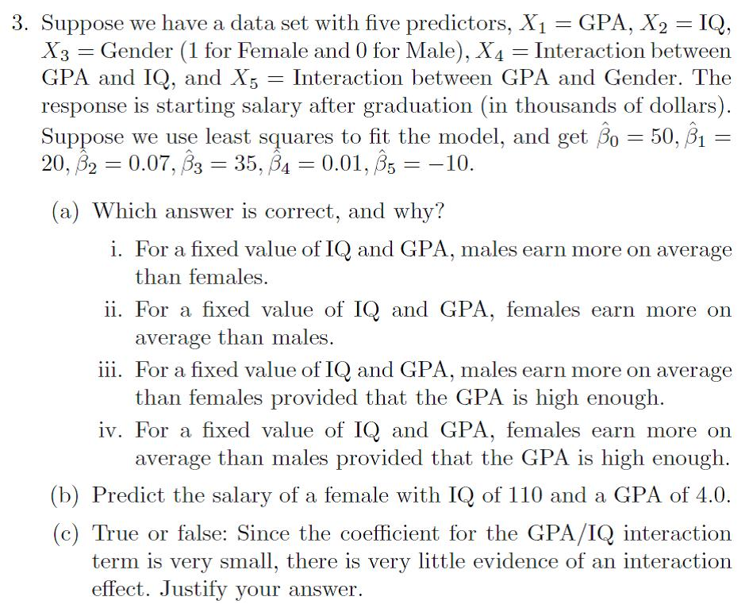
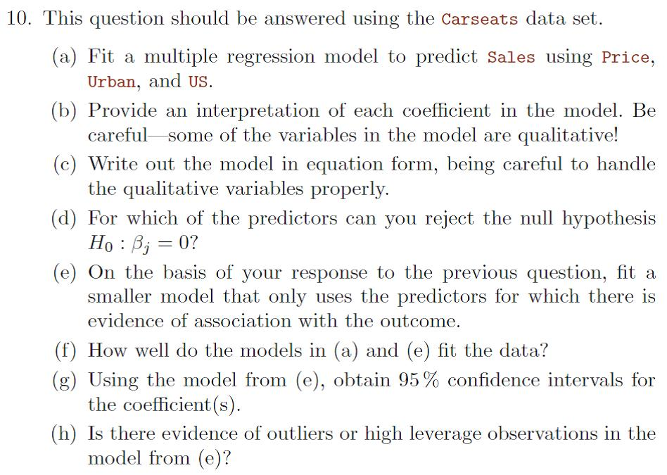

---

<script type="text/x-mathjax-config">
MathJax.Hub.Config({
  TeX: { equationNumbers: { autoNumber: "AMS" } }
});
</script>


## Ejercicio N°3 (Conceptual)

### Enunciado - Página 129 del libro 
<center>
{width=15cm}
</center>

### Resolución

Los predictores que se emplean para predecir la variable de respuesta $Y=\mathrm{Salary}$ son los siguientes:
<ul>
    <li> $X_1=\mathrm{GPA}$</li>
    <li> $X_2=\mathrm{IQ}$</li>
    <li> $X_3=\mathrm{Gender}$ (1 para '$\mathrm{Female}$' y 0 para '$\mathrm{Male}$')</li>
    <li> Interacción entre $\mathrm{GPA}$ y $\mathrm{IQ}$: $X_1 X_2$</li>
    <li> Interacción entre $\mathrm{GPA}$ y $\mathrm{Gender}$: $X_1 X_3$</li>
</ul>

El modelo que predice la respuesta en función de los predictores listados, teniendo en cuenta la interacción entre las variables $X_1$ con $X_2$ y $X_3$ se puede escribir como

\begin{equation}
Y = \hat{\beta_0} + \hat{\beta_1}X_1 + \hat{\beta_2}X_2 + \hat{\beta_3}X_3  +\hat{\beta_4}X_1 X_2 + \hat{\beta_5}X_1 X_3 + \epsilon.(\#eq:Ej3-modelo0)
\end{equation}

Reemplazando los valores correspondientes de las $\hat{\beta_j}$ y los nombres para cada variable, el modelo \@ref(eq:Ej3-modelo0) queda 

\begin{equation}
\mathrm{Salary} = 50 + 20\cdot\mathrm{GPA} + 0.07\cdot\mathrm{IQ} + 35\cdot\mathrm{Gender} + 0.01\cdot\mathrm{GPA}\times\mathrm{IQ} - 10\cdot\mathrm{GPA}\times\mathrm{Gender}. (\#eq:Ej3-modelo1)
\end{equation}


```{r}
library(plotly)
Salary_f <- function(GPA, IQ){
  Gender = 1
  50 + 20*GPA + 0.07*IQ + 35*Gender + 0.01*GPA*IQ - 10*GPA*Gender
}

Salary_m <- function(GPA, IQ){
  Gender = 0
  50 + 20*GPA + 0.07*IQ + 35*Gender + 0.01*GPA*IQ - 10*GPA*Gender
}

GPA <- seq(0, 4, length = 20)
IQ <- seq(70, 130, length = 20)
zf <- t(outer(GPA, IQ, Salary_f)) #Uso transpuesta porque sino quedo al reves!!
zm <- t(outer(GPA, IQ, Salary_m))


fig <- plot_ly(showscale = TRUE)
fig <- fig %>% add_surface(x = ~GPA, y = ~IQ, z = ~zf, cmin = min(zf), cmax = max(zf),
                           colorscale = list(c(0,1), c("rgb(255,112,184)","rgb(128,0,64)")),
                           colorbar=list(title='Female'), type = 'mesh3d')
fig <- fig %>% add_surface(x = ~GPA, y = ~IQ, z = ~zm, cmin = min(zm), cmax = max(zm),
                           colorscale = list(c(0,1), c("rgb(107,184,214)","rgb(0,90,124)")),
                           colorbar=list(title='Male'), opacity = 0.98, type = 'mesh3d') 
fig <- fig %>% layout(
    title = "Modelos para Gender=Female y Gender=Male",
    scene = list(
      xaxis = list(title = "GPA", range = c(0, 4)),
      yaxis = list(title = "IQ", range = c(70, 130)),
      zaxis = list(title = "Salary", range = c(min(zm),max(zm)))
    ))
```

<center>
```{r}
fig
```
</center>

### Item a)

**Incisos i. y ii.** Para responder a los incisos i. y ii., se puede recurrir al siguiente analisis: al fijar las variables $\mathrm{IQ}$ y $\mathrm{GPA}$, el modelo original \@ref(eq:Ej3-modelo1) se reduce a

$$\begin{equation}
\mathrm{Salary}|_{\mathrm{IQ},\mathrm{GPA}} = C + (35 - 10\cdot\mathrm{GPA})\times\mathrm{Gender}
\end{equation}$$

donde $C$ es una constante que incluye el término independiente $\hat{\beta_0}=50$ y los términos $20\cdot\mathrm{GPA}$, $0.07\cdot\mathrm{IQ}$, y $0.01\cdot\mathrm{GPA}\times\mathrm{IQ}$. Siendo que la variable $\mathrm{Gender}$ adopta el valor 0 en el caso de los varones, la expresión anterior se reduce a

$$\begin{equation}
\mathrm{Salary}|_{\mathrm{IQ},\mathrm{GPA},\mathrm{Gender}=0} = C
\end{equation}$$

En el caso de las mujeres, $\mathrm{Gender}=1$, el modelo queda

$$\begin{equation}
\mathrm{Salary}|_{\mathrm{IQ},\mathrm{GPA},\mathrm{Gender}=1} = C + 35 - 10\cdot\mathrm{GPA}
\end{equation}$$

Siendo que la variable $\mathrm{GPA}$ puede variar entre 0 y 4.0, los valores extremos para $\mathrm{Salary}|_{\mathrm{IQ},\mathrm{GPA},\mathrm{Gender}=1}$ son $C+35$ y $C-5$ respectivamente. Al promediar estos dos valores, queda $\overline{\mathrm{Salary}}|_{\mathrm{IQ},\mathrm{GPA},\mathrm{Gender}=1}=C+15$. 

**Conclusión:** para un valor fijo de $\mathrm{IQ}$ y $\mathrm{GPA}$, las mujeres ganan 15 mil dólares más en promedio que los varones.


<br>
**Incisos iii. y iv.** Para responder a estos dos incisos, se puede igualar las expresiones $\mathrm{Salary}|_{\mathrm{IQ},\mathrm{GPA},\mathrm{Gender}=0}$ y $\mathrm{Salary}|_{\mathrm{IQ},\mathrm{GPA},\mathrm{Gender}=1}$ correspondientes a los modelos que describen el salario percibido por varones y mujeres respectivamente dados $\mathrm{IQ}$ y $\mathrm{GPA}$ fijos. De dicha operación, resulta que

$$\begin{align}
\mathrm{Salary}|_{\mathrm{IQ},\mathrm{GPA},\mathrm{Gender}=0} &=                            \mathrm{Salary}|_{\mathrm{IQ},\mathrm{GPA},\mathrm{Gender}=1} \\
C &= C + 35 - 10\cdot\mathrm{GPA} \\
\mathrm{GPA} &= 3.5
\end{align}$$

A partir de $\mathrm{GPA}=3.5$, los salarios entre varones y mujeres se igualan. 

**Conclusión:** Para valores suficientemente altos de $\mathrm{GPA}$, por ejemplo, $\mathrm{GPA}\geq3.5$, los varones ganan más en promedio que las mujeres.


### Item b)

La variable $\mathrm{Gender}$ es cualitativa con valores 1 y 0 correspondientes a $\mathrm{female}$ y $\mathrm{male}$ respectivamnte. De esta manera, la predicción $\hat{\mathrm{Salary}}$ para una persona del sexo femenino ($\mathrm{Gender}=\mathrm{'female'}\equiv 1$), con $\mathrm{IQ}=110$ y $\mathrm{GPA}=4.0$ se puede obtener haciendo los reemplazos correspondientes en la ecuación \@ref(eq:Ej3-modelo1). En R, sería:

```{r}
GPA = 4.0
IQ = 110
Gender = 1 #equivalente a 'female'
beta = c(50, 20, 0.07, 35, 0.01, -10)
X = c(1, GPA, IQ, Gender, GPA*IQ, GPA*Gender)
Salary = beta %*% X #Producto escalar entre X y beta
print(Salary)
```
<br>
**Conclusión:** El salario inmediatamante después de graduarse de una mujer con $\mathrm{IQ}=110$ y $\mathrm{GPA}=4.0$ se predice que es de 137.1 mil dólares.


### Item c)
El hecho de que el coeficiente del término de interacción entre $\mathrm{GPA}$ y $\mathrm{IQ}$ sea pequeño no implica que su efecto en el modelo sea despreciable. El parámetro que indica si un término debe ser incluido o no es el p-valor, el cual debe ser menor a 0.05. En tal caso, se dice que no hay evidencia suficiente para rechazar la hipótesis alternativa $H_1: \beta_4\neq0$.


---
## Ejercicio N°10 (Aplicado)

### Enunciado - Página 132 del libro 
<center>
{width=15cm}
</center>

### Resolución

En primer lugar se debe llamar a las librerías que utilizaremos en la resolución de este caso:

```{r setup, include=FALSE}
knitr::opts_chunk$set
library(mosaic)
library(car)
library(ISLR)
library(ggplot2)
library(dplyr)
library(tidyverse)
library(ggpubr)
```
<br>

Se define el $\mathtt{dataFrame}$ $\mathrm{datos}$ tomando el conjunto $\mathrm{Carseats}$

```{r}
datos = ISLR::Carseats
```
<br>

Luego, se muestran las primeras filas del $\mathtt{dataFrame}$, y la estructura del conjunto de datos

```{r}
datos %>% head()
datos %>% str()
```
<br>

Se observa que el conjunto de datos contiene $n=400$ observaciones y $p=11$ variables, de las cuales 3 de estas últimas ($\mathrm{ShelveLoc}$, $\mathrm{Urban}$ y $\mathrm{US}$) son cualitativas.


Previo a la construcción del modelo de regresión multivariada para predecir $\mathrm{Sales}$ en función de $\mathrm{Price}$, $\mathrm{Urban}$ y $\mathrm{US}$, se realiza un analisis exploratorio de los predictores. 


**Resumen Numérico**
```{r}
# Resumen numérico para la variable Price
summary(datos$Price)

# Resumen numérico variable Urban
freq_Urban = prop.table(table(datos$Urban)) %>% as.data.frame() %>%
    setNames(c("Nivel","FrecRel"))
print(freq_Urban)

# Resumen numérico variable US
freq_US = prop.table(table(datos$US)) %>% as.data.frame() %>% 
    setNames(c("Nivel","FrecRel"))
print(freq_US)
```

<br>
**Resumen Gráfico**
```{r}
boxplot_Price = ggplot(data = datos, aes(x = 0, y = Price)) +
    geom_boxplot(outlier.shape = NA, width = 0.3) + 
    geom_jitter(alpha = 0.3, width = 0.15) +
    scale_color_manual(values = "blue3") + theme_bw()

hist_Price = ggplot(data = datos, aes(x = Price)) +
    geom_histogram(aes(y=..density..), binwidth = 10, color = "black", fill = "white") + 
    geom_density(alpha = .2, fill = "#FF6666") +
    theme_bw()

plots_Price <- ggarrange(boxplot_Price, hist_Price, legend = "top")

bar_Urban = ggplot(data = freq_Urban, aes(x = Nivel, y = FrecRel)) + 
    geom_bar(stat = "identity", width = 0.5, show.legend = TRUE) + 
    theme_bw()
    
bar_US = ggplot(data = freq_US, aes(x = Nivel, y = FrecRel)) + 
    geom_bar(stat = "identity", width = 0.5, show.legend = TRUE) + 
    theme_bw()

plots_Urban_Us <- ggarrange(bar_Urban, bar_US, legend = "top")

```

<center>
```{r}
plots_Price
plots_Urban_Us
```
</center>


### Items a)-f)

A continuación se procede a la construcción del modelo de regresión lineal múltiple que relaciona las variables predictoras $\mathrm{Price}$, $\mathrm{Urban}$ y $\mathrm{US}$ con la respuesta $\mathrm{Sales}$. Ante la presencia de predictores de variable categórica ($\mathrm{Urban}$ y $\mathrm{US}$), [R] define una variable *dummy* que, en ambos casos, adopta el valor '0' para '$\mathrm{No}$' y '0' para '$\mathrm{Yes}$'. Se construirán varios modelos y luego se analizarán con el comando $\mathtt{summary()}$ para seleccionar el modelo más adecuado

```{r}
Sales = datos$Sales
Price = datos$Price
Urban = datos$Urban
US    = datos$US

# Modelo completo incluyendo todas las interacciones
modelo0 = lm(Sales ~ Price*Urban*US)
sum0 = summary(modelo0)
pval0 = as.data.frame(sum0[4])[,4]
sum0
```

Según los datos mostrados en el resumen del modelo, se aprecia que ninguno de los coeficientes es significativo excepto el correspondiente a $\mathrm{Price}$ ($\hat{\beta_1}$). Por este motivo se deberán ajustar modelos de menor complejidad. Previo a ello, se plotean graficas de puntos para identificar dependencias entre las variables utilizando las variables categóricas en estudio.

<center>
```{r}
# Plots para observar correlacion entre variables
library(mosaic)
scatter1 = scatterplotMatrix(~ Sales + Price | Urban, data = datos)
scatter2 = scatterplotMatrix(~ Sales + Price | US, data = datos)
interaction = interaction.plot(US, Urban, Sales, data = datos)
```
</center>

A continuación se construye un modelo de menor complejidad retirando el termino de interaccion entre Price, UrbanYes y USYes:


```{r}
# Modelo reducido sin interaccion Price:Urban:US
modelo1 = lm(Sales ~ Price + Urban + US + Price:Urban + Price:US + Urban:US)
sum1 = summary(modelo1)
pval1 = as.data.frame(sum1[4])[,4]
sum1
```

De el anterior análisis se puede ver que el término de interaccion UrbanYes:USYes sería significativo (a pesar de violar levemente el umbral de $p<0.05$), por la cual los términos independientes respectivos también deben ser incluidos en el modelo a pesar que sus significancias sean despreciables. 

Por tal motivo, se eliminan las variables restantes dando lugar al siguiente modelo:

```{r}
# Modelo reducido sin las interacciones de Price
modelo2 = lm(Sales ~ Price + Urban + US + Urban:US)
sum2 = summary(modelo2)
pval2 = as.data.frame(sum2[4])[,4]
sum2
```

Con el mismo argumento que en lo realizado previamente, se podria decir que todos los términos son significativos, a pesar que el término de interacción viola levemente el umbral de $p<0.05$. Por otro lado, se podría evaluar el modelo sin el término de interacción UrbanYes:USYes, lo cual lleva a 

```{r}
# Modelo reducido sin la interaccion Urban:US
modelo3 = lm(Sales ~ Price + Urban + US)
sum3 = summary(modelo3)
pval3 = as.data.frame(sum3[4])[,4]
sum3
```

Del análisis de los p-valores se concluye que existe evidencia suficiente para descartar el término correspondiente a UrbanYes. Se puede, entonces, cosntruir un nuevo modelo aún más simplificado:

```{r}
# Modelo reducido sin la variable Urban
modelo4 = lm(Sales ~ Price + US)
sum4 = summary(modelo4)
pval4 = as.data.frame(sum4[4])[,4]
sum4
```


El modelo seleccionado es el modelo XXXX.

```{r}
modelo_fit = modelo4
```

A continuación se muestran las gráficas de residuos y de puntos de influencia

<center>
```{r, cache=FALSE}
#ploteo de residuos
par(mfrow = c(2, 2)) 
plot(modelo_fit)
residualPlots(modelo_fit)
influenceIndexPlot(modelo_fit)
```
</center>

De las gráficas previas se puede concluir que no existen puntos influyentes ni **outliers**, y que los residuos poseen una distribución normal con varianza aproximadamente uniforme.


La expresión matemática del modelo ajustado, teniendo en cuenta la presencia de variables categóricas, es

$$\begin{align}
\mathrm{Sales} &= \hat{\beta_0} + \hat{\beta_1}\times\mathrm{Price} + \hat{\beta_3}\times\mathrm{US} + \epsilon\\
&= \begin{cases}
               \hat{\beta_0} + \hat{\beta_1}\times\mathrm{Price} + \hat{\beta_3} + \epsilon,  \quad\text{si}\quad \mathrm{US}=1\\
               
               \hat{\beta_0} + \hat{\beta_1}\times\mathrm{Price} + \epsilon,  \quad\text{si}\quad \mathrm{US}=0\\
               
               
   \end{cases}
\end{align}$$


La hipótesis nula $H_0: \hat{\beta_j}=0$ puede ser rechazada para $j=0,\,1,\,\text{y }\,3$, dado que sus p-valores correspondientes son todos $<0.05$, con lo cual no existe evidencia suficiente para rechazar la hipótesis alternativa $H_0: \hat{\beta_j}\neq0$. Con esto se concluye que dichos parámetros son significativos para el modelo, y que el término correspondiente a la variable $\mathrm{Urban}$ puede ser excluído del modelo.


### Item g)
XXXXXXXXXXXXXXXX

### Item h)
No existe evidencia de puntos de elevada palanca ni de **outliers** tal como fue mostrado previamente
